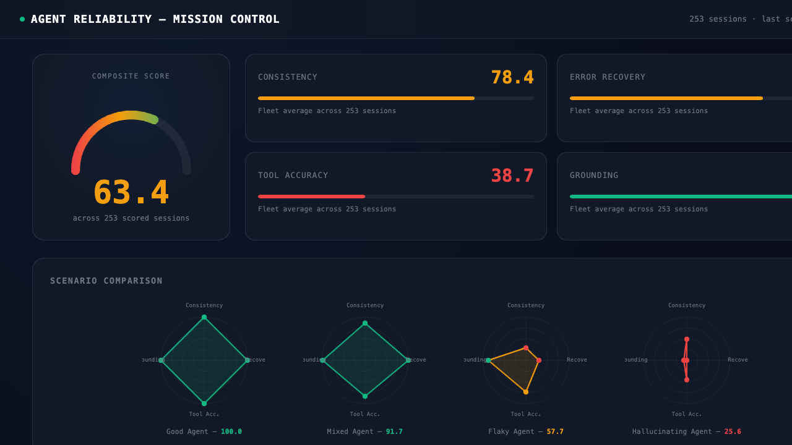
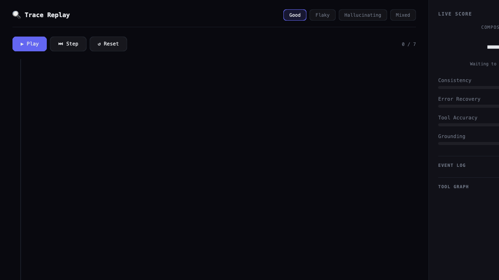

# Agent Reliability Scores

**The credit score for AI agents.**

You wouldn't hire an employee without a resume. Why deploy an agent without a reliability score?

## Screenshots

### Mission Control Dashboard


### Trace Replay


## What It Does

AI agents make mistakes — hallucinate, pick wrong tools, give confident answers based on nothing, or fail silently. Nobody measures this. You just hope it works.

This tool **watches agents and scores them** on 4 dimensions:

| Dimension | What It Measures |
|-----------|-----------------|
| **Consistency** | Same input → same quality output? Or wildly different each time? |
| **Error Recovery** | When something breaks, does the agent fix it or pretend nothing happened? |
| **Tool Accuracy** | Right tool for the job? Or random guessing? |
| **Grounding** | Are answers backed by actual data? Or made up? |

Each session gets scored 0–100, combined into one composite number.

## Why It Matters

- **Trust** — "This agent scores 85, I can trust it for this task"
- **Debugging** — "Scored 25 on grounding because it ignored tool output — now I know exactly what to fix"
- **Comparison** — "Agent A scores 92, Agent B scores 58 on the same task — easy choice"
- **Monitoring** — "Scores dropped from 80 to 60 this week — something broke"

## How to Use

### Quick Start (5 minutes)

```bash
# 1. Generate demo scenarios
python3 scripts/demo_scenario.py

# 2. Score them
python3 scripts/scorer.py

# 3. Open the dashboard
open data/dashboard.html
```

### Real Usage

```bash
# 1. Use your agent normally — logs accumulate automatically
#    (gateway.log + session transcripts in ~/.hermes/sessions/)

# 2. Parse logs into structured traces
python3 scripts/trace_parser.py

# 3. Score every session
python3 scripts/scorer.py

# 4. View results
open prototypes/cockpit-dashboard.html    # Overview dashboard
open prototypes/trace-replay.html         # Step through any session
```

### As a Cron Job (Automated Monitoring)

```bash
# Score daily at midnight, deliver results to Telegram
hermes cron create \
  --name "Agent Reliability Score" \
  --prompt "Run: python3 ~/.hermes/skills/agent-reliability/scripts/trace_parser.py && python3 ~/.hermes/skills/agent-reliability/scripts/scorer.py" \
  --schedule "0 0 * * *" \
  --deliver telegram
```

### Compare Models / Providers

1. Run the same workflow through Provider A → score it
2. Run the same workflow through Provider B → score it
3. Compare composite scores + dimension breakdowns
4. Winner is the one with higher reliability, not just lower cost

### Catch Regressions

1. Score your agent (baseline)
2. Change your system prompt, tools, or model
3. Score again
4. Did reliability go up or down?

## Components

| File | Purpose |
|------|---------|
| `scripts/trace_parser.py` | Parses gateway logs + session transcripts into structured traces |
| `scripts/scorer.py` | Computes reliability scores, stores in SQLite |
| `scripts/dashboard.py` | Generates original static HTML dashboard |
| `scripts/demo_scenario.py` | Creates 4 synthetic scenarios for demo |
| `prototypes/cockpit-dashboard.html` | Interactive overview — gauges, radar charts, fleet grid |
| `prototypes/trace-replay.html` | Step through any session event-by-event |
| `data/scores.db` | SQLite database with all scored sessions |
| `data/traces/` | Parsed trace JSON files |

## Demo Scenarios

| Scenario | Composite | What Happens |
|----------|-----------|--------------|
| ✅ Good Agent | **100.0** | Right tools, correct data, clean response |
| ⚠️ Mixed Agent | **91.7** | Mostly good, one partial failure recovered |
| 🔴 Flaky Agent | **57.7** | Timeouts, retries, inconsistent answers |
| 💀 Hallucinating Agent | **25.6** | Ignores real data, makes up confident answers |

Run `python3 scripts/demo_scenario.py` to generate fresh traces for all 4.

## Scoring Details

**Consistency (25% weight)**
- Response time variance (high = inconsistent)
- Repeated error patterns
- Missing responses to user messages

**Error Recovery (25% weight)**
- Did the agent recover after errors/timeouts?
- Or did failures go unaddressed?

**Tool Accuracy (25% weight)**
- Did tool calls succeed?
- Were results used in the final answer?
- Orphaned calls (fired but never referenced)?

**Grounding (25% weight)**
- Ratio of agent output to tool output (high = hallucinating)
- Specific data points cited from tools
- Unsupported claims penalty

## Data Storage

- Traces: `data/traces/*.json`
- Scores: `data/scores.db` (SQLite)
- Dashboard: `data/dashboard.html`

## Requirements

- Python 3.10+
- No external dependencies (zero-dep by design)
- Hermes gateway logs or session transcripts
